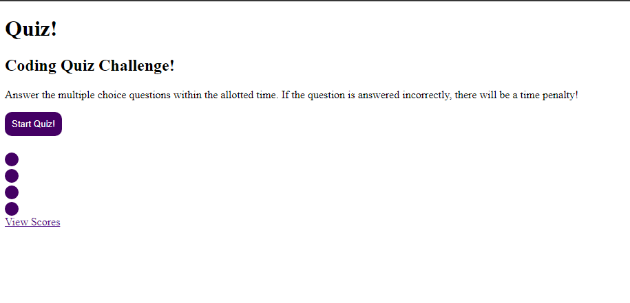

# Coding Quiz
## Screenshot oof the Deployed Page

## URLs
* [Github Repository](https://github.com/SoloSolaire/coding-quiz)
* [Deployed Page](https://solosolaire.github.io/coding-quiz/index.html)

## Description
For week 4's challenged, I was assigned to create a timed quiz on JavaScript fundamentals that stored the high scores. This code features a timer that will start when the "start button" is clicked. You will be cycled through each of the questions and if answered incorrectly there will be a timer deduction of 5 seconds. When the quiz is over, it'll lead to a highscore page stored with your initials and score.